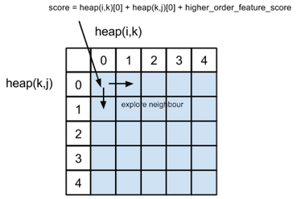

# Cube Pruning Eisner Parser Design Doc                                                                                     

The cube pruning approach is similar to the methods described in the following paper:                                                    
* Hao Zhang; Ryan McDonald. [Enforcing Structural Diversity in Cube-pruned Dependency Parsing](http://www.aclweb.org/anthology/P/P14/P14-2107.pdf). EMNLP 2014. 
* Hao Zhang; Ryan McDonald. [Generalized Higher-Order Dependency Parsing with Cube Pruning](http://www.aclweb.org/anthology/D/D12/D12-1030.pdf)                                                                                     
* Hao Zhang; Liang Huang; Kai Zhao; Ryan McDonald. [Online Learning for Inexact Hypergraph Search](http://www.aclweb.org/anthology/D/D13/D13-1093.pdf). [attachment](http://www.aclweb.org/anthology/attachments/D/D13/D13-1093.Attachment.pdf)                                                                                                       

## Design                                                                                                         

Each parsing state will have a parsing history(possible parsing sub trees). We combine two parsing state using cube-pruning to prune out the subtrees that are not likely to appear in the optimal result. In other words, each spam will generate a best-of-k subtrees of that spam. After filling out the whole eisner matrix, 
a forest of possible parsing trees will be generated.          

### Data Structure
The basic chart element is `EisnerHeap`, which stores the state information of one specific chart location. The Eisner matrix is a n by n two-dimentional array of `EisnerHeap`

#### `EisnerHeap` member  

* `bestK`: Specify the number of parsing histories(sub trees), the size of `buf`  
* `cube`: Three dimensional array [n][k][k], used in cube-pruning stage to color the search history of cube pruning  
* `buf`: Array of `bestK` number of possible sub trees in descending order in terms of root score 
* `heap`: heap structure used in cube pruning stage
* `state`: a tuple containing state information, (head, depend, direction, shape)
 

### Pseudocode
``` 
Parse(sentence, arc_weight):
	for m in (1, n):
		for s in (0, n):
			t = s + m
            for q in (s, t):
                find top node N1 in heap[s][q][1][0].buf, top node N2 in heap[q][t][0][0].buf
                score = calculate the score of heap[s][t][0][1]
                push (score, q, N1, N2) into heap[s][t][0][1].heap

                find top node N1 in heap[s][q][1][0].buf, top node N2 in heap[q][t][0][0].buf
                score = calculate the score of heap[s][t][1][1]
                push (score, q, N1, N2) into heap[s][t][1][1].heap

                find top node N1 in heap[s][q][0][0].buf, top node N2 in heap[q][t][0][1].buf
                score = calculate the score of heap[s][t][0][0]
                push (score, q, N1, N2) into heap[s][t][0][0].heap

                find top node N1 in heap[s][q][1][1].buf, top node N2 in heap[q][t][1][0].buf
                score = calculate the score of heap[s][t][1][0]
                push (score, q, N1, N2) into heap[s][t][1][0].heap

            Expore(heap[s][t][0][1].heap, heap[s][t][0][1].buf, score_calculator_func)
            Expore(heap[s][t][1][1].heap, heap[s][t][1][1].buf, score_calculator_func)
            Expore(heap[s][t][0][0].heap, heap[s][t][0][0].buf, score_calculator_func)
            Expore(heap[s][t][1][0].heap, heap[s][t][1][0].buf, score_calculator_func)

Expore(heap, buf, score_calculator_func):
	while heap is not empty and size of buf < bestK:
		node T = heap.pop()
		push T to buf
		find the cube C that generate T
		for each neighbour E of T in C:
			if E is not marked:
				E.score = state_generating_func(E)
				mark E in C
				heap.push(E)

```


 


